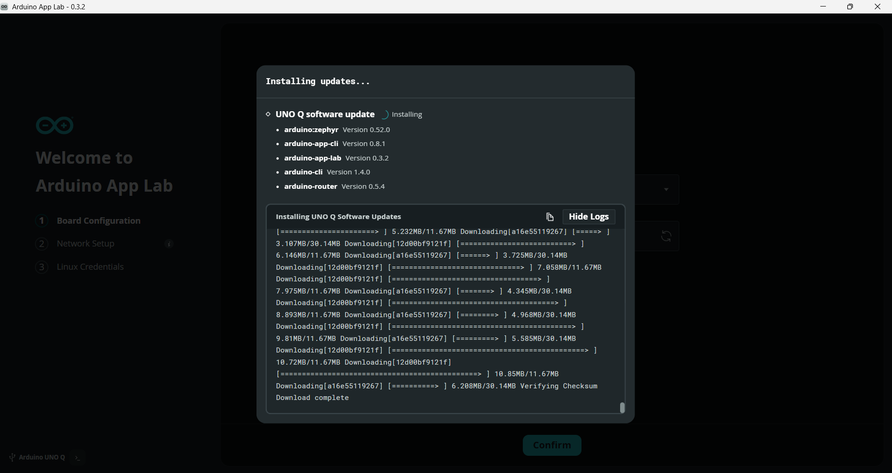
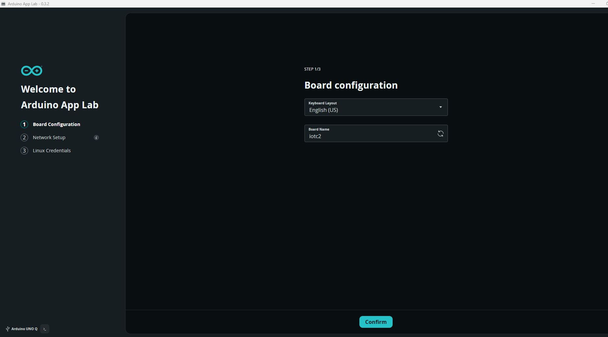
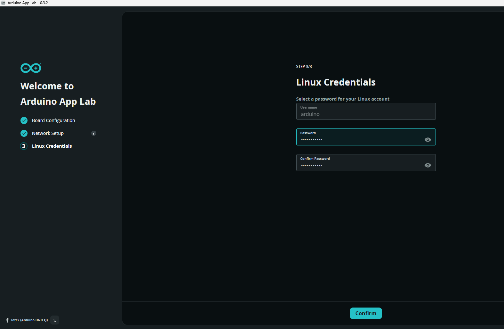
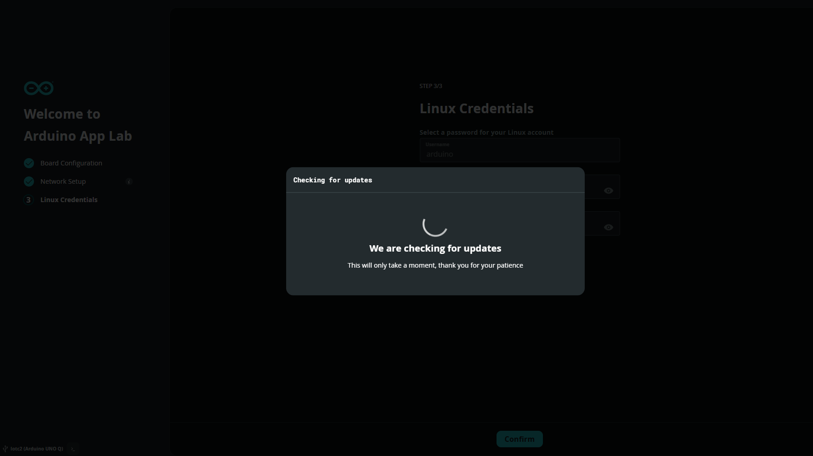
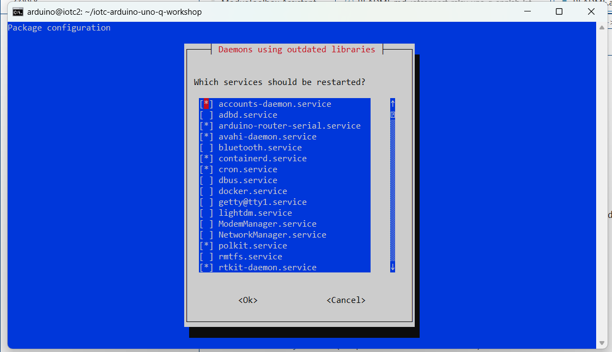
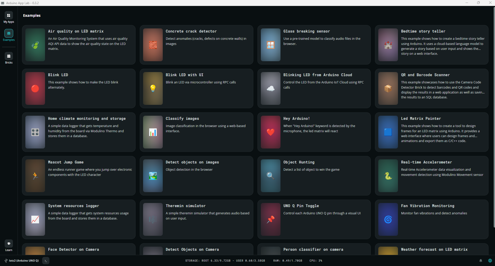

# Automated Lab Flow (Arduino UNO Q -> IOTCONNECT via Relay)

This README describes the automated path for the customer lab. The scripts run on the UNO Q host OS. Participants can
use their Windows laptop for account creation, certificates, and shell access.

What is automated on the UNO Q:
- IOTCONNECT Python Lite SDK install
- Relay server and client download
- socat TCP bridge (container -> host relay socket)
- systemd services for relay + bridge
- App Lab project patch (copy relay client + insert init block)
- Health checks

What is still manual:
- IOTCONNECT account/device creation
- Downloading device certs and config from IOTCONNECT
- Arduino App Lab installation
- Android tools (ADB) installation on the laptop

---


## Before Step 1: PC + Board Prep

Follow these once on your Windows laptop before starting Step 1.

1) Install Arduino App Lab on your PC:
   - https://www.arduino.cc/en/software/#app-lab-section
   
   
   

2) Connect the UNO Q to your PC with a USB cable.
   

3) Enter your Wi-Fi credentials and set up connectivity.
   
   

4) Update the board when prompted.
   
   

5) Restart the board.
   

6) Reconnect to the board.

7) In App Lab, open Examples to view all available apps.
   

7a) Open the App Lab terminal (useful for running commands on the UNO Q).
   

8) Open IOTCONNECT at `console.iotconnect.io`.

9) Create a device.

10) Download the device certs and `iotcDeviceConfig.json`, then extract them on your host PC.

## Prerequisites

On the laptop (manual):
1) Create the IOTCONNECT device and template for the lab.
2) Download the device files:
   - `iotcDeviceConfig.json`
   - `device-cert.pem`
   - `device-pkey.pem`
   Note: the downloaded cert files may include the device name (for example, `cert_unoQ2mcl.crt` and `key_unoQ2mcl.key`).
   The setup script will try to copy them to `device-cert.pem` and `device-pkey.pem` automatically.
3) Use the SCP commands below to push the files to the UNO Q.

On the UNO Q (manual once):
- Arduino App Lab installed
- Internet access (Ethernet or Wi-Fi)

---

## Step 1: Clone this repo on the UNO Q

```bash
cd /home/arduino

git clone https://github.com/mlamp99/iotc-arduino-uno-q-workshop
cd iotc-arduino-uno-q-workshop

chmod +x scripts/*.sh
```

---

## Windows Step: Find the UNO Q IP, then SCP certs to the UNO Q (minimal typing)

### 1) Get the UNO Q IP address

On the UNO Q terminal:

```bash
hostname -I
```

If you see more than one IP, use the last one listed (example: `10.50.0.199`). Ignore `172.17.0.1` (that is the App Lab container bridge).

### 2) Copy certs from Windows to the UNO Q

Run these commands on the Windows laptop after you download the IOTCONNECT files.

```powershell
# 1) Send the config JSON from Downloads
cd Downloads
scp iotcDeviceConfig.json arduino@<UNOQ_IP>:/tmp/

# 2) Send all files from the extracted certs folder
# (folder name varies by device, so use the extracted *certificates* folder)
cd Downloads\*certificates*
scp * arduino@<UNOQ_IP>:/tmp/
```

Then on the UNO Q:

Continue to Step 2 to run the setup script.

---

## Step 2: Run the automated host setup (if you have not already)

This installs the IOTCONNECT Python Lite SDK, installs socat, downloads the relay server + client, and sets up systemd services.

```bash
cd /home/arduino/iotc-arduino-uno-q-workshop
sudo ./scripts/unoq_setup.sh --demo-dir /home/arduino/demo
```

If `iotc-socat.service` shows a bad unit file setting, re-run the setup script (it now installs a helper script for the ExecStartPre wait).

Optional flags:
- `--bridge-port 8899`
- `--no-systemd` (skip service install/start)
- `--skip-apt` (skip apt install step)
- `--skip-sdk` (skip IOTCONNECT Python Lite SDK install)
- `--no-rename-certs` (skip renaming cert/key files in the demo dir)
- `--pip-break-system-packages` (default; allow pip to install system-wide packages on Debian)

---

## Step 3: Verify the host setup

```bash
./scripts/unoq_verify.sh --demo-dir /home/arduino/demo
```

You should see:
- IOTCONNECT Lite SDK import check ok
- Relay socket present: `/tmp/iotconnect-relay.sock`
- Port 8899 listening

---

## Examples Index

Use these IOTCONNECT-specific guides:

- [air-quality-monitoring](app-configs/air-quality-monitoring/README.md)
- [anomaly-detection](app-configs/anomaly-detection/README.md)
- [audio-classification](app-configs/audio-classification/README.md)
- [bedtime-story-teller](app-configs/bedtime-story-teller/README.md)
- [blink](app-configs/blink/README.md)
- [blink-with-ui](app-configs/blink-with-ui/README.md)
- [cloud-blink](app-configs/cloud-blink/README.md)
- [code-detector](app-configs/code-detector/README.md)
- [home-climate-monitoring-and-storage](app-configs/home-climate-monitoring-and-storage/README.md)
- [image-classification](app-configs/image-classification/README.md)
- [keyword-spotting](app-configs/keyword-spotting/README.md)
- [led-matrix-painter](app-configs/led-matrix-painter/README.md)
- [mascot-jump-game](app-configs/mascot-jump-game/README.md)
- [object-detection](app-configs/object-detection/README.md)
- [object-hunting](app-configs/object-hunting/README.md)
- [real-time-accelerometer](app-configs/real-time-accelerometer/README.md)
- [system-resources-logger](app-configs/system-resources-logger/README.md)
- [theremin](app-configs/theremin/README.md)
- [unoq-pin-toggle](app-configs/unoq-pin-toggle/README.md)
- [vibration-anomaly-detection](app-configs/vibration-anomaly-detection/README.md)
- [video-face-detection](app-configs/video-face-detection/README.md)
- [video-generic-object-detection](app-configs/video-generic-object-detection/README.md)
- [video-person-classification](app-configs/video-person-classification/README.md)
- [weather-forecast](app-configs/weather-forecast/README.md)

---

## App Lab folder name mapping

Use these when running the patch script:

- `air-quality-monitoring` -> `/home/arduino/ArduinoApps/air-quality-on-led-matrix`
- `anomaly-detection` -> `/home/arduino/ArduinoApps/concrete-crack-detector`
- `audio-classification` -> `/home/arduino/ArduinoApps/glass-breaking-sensor`
- `bedtime-story-teller` -> `/home/arduino/ArduinoApps/bedtime-story-teller`
- `blink` -> `/home/arduino/ArduinoApps/blink-led`
- `blink-with-ui` -> `/home/arduino/ArduinoApps/blink-led-with-ui`
- `cloud-blink` -> `/home/arduino/ArduinoApps/<APP_LAB_FOLDER>` (not in the default App Lab list)
- `code-detector` -> `/home/arduino/ArduinoApps/qr-and-barcode-scanner`
- `home-climate-monitoring-and-storage` -> `/home/arduino/ArduinoApps/home-climate-monitoring-and-storage`
- `image-classification` -> `/home/arduino/ArduinoApps/classify-images`
- `keyword-spotting` -> `/home/arduino/ArduinoApps/hey-arduino`
- `led-matrix-painter` -> `/home/arduino/ArduinoApps/led-matrix-painter`
- `mascot-jump-game` -> `/home/arduino/ArduinoApps/mascot-jump-game`
- `object-detection` -> `/home/arduino/ArduinoApps/detect-objects-on-images`
- `object-hunting` -> `/home/arduino/ArduinoApps/object-hunting`
- `real-time-accelerometer` -> `/home/arduino/ArduinoApps/real-time-accelerometer`
- `system-resources-logger` -> `/home/arduino/ArduinoApps/<APP_LAB_FOLDER>` (not in the default App Lab list)
- `theremin` -> `/home/arduino/ArduinoApps/theremin-simulator`
- `unoq-pin-toggle` -> `/home/arduino/ArduinoApps/<APP_LAB_FOLDER>` (not in the default App Lab list)
- `vibration-anomaly-detection` -> `/home/arduino/ArduinoApps/fan-vibration-monitoring`
- `video-face-detection` -> `/home/arduino/ArduinoApps/face-detector-on-camera`
- `video-generic-object-detection` -> `/home/arduino/ArduinoApps/detect-objects-on-camera`
- `video-person-classification` -> `/home/arduino/ArduinoApps/person-classifier-on-camera`
- `weather-forecast` -> `/home/arduino/ArduinoApps/weather-forecast-on-led-matrix`

---

## Step 4: Choose and clone a lab example in App Lab

In Arduino App Lab:
1) Browse examples from `app-bricks-examples`.
2) Copy the selected app into your workspace.
3) Note the app folder path (example: `/home/arduino/ArduinoApps/air-quality-on-led-matrix`).
4) Open the matching guide in `app-configs/<example>/README.md`.
5) Use the placeholder template in `app-configs/<example>/device-template.json` and fill in telemetry + commands for your lab.

---

## Step 5: Patch the App Lab project for IOTCONNECT

This copies the patched relay client into the app. If a pre-patched `main.py` exists in
`app-configs/<example>/python/main.py`, it will overwrite your app’s `python/main.py`.

```bash
./scripts/unoq_patch_app.sh /home/arduino/ArduinoApps/air-quality-on-led-matrix air-quality-monitoring
```

If your App Lab folder name differs from the example name, pass it explicitly:

```bash
./scripts/unoq_patch_app.sh /home/arduino/ArduinoApps/my-air-quality air-quality-monitoring
```

After patching, open `python/main.py` and add telemetry calls where your app produces data:

```python
# Example
IOTC_SEND({"temp_c": temp_c, "humidity": humidity})
```

---

## Step 6: Run the app and confirm telemetry

1) Run the app in App Lab.
2) Confirm telemetry appears in IOTCONNECT.
3) If you enabled commands, test a command from IOTCONNECT and verify the app receives it.

Expected result: the selected App Lab example runs on the UNO Q and publishes telemetry to IOTCONNECT.

---

## Scripts

- `scripts/unoq_setup.sh`
  - Installs socat
  - Downloads relay server and client into `/home/arduino/demo`
  - Configures and starts systemd services

- `scripts/unoq_patch_app.sh <app_dir>`
  - Copies `app-lab/iotc_relay_client.py` into `<app_dir>/python/`
  - Inserts a minimal IOTCONNECT init block into `<app_dir>/python/main.py`
  - Reads `app-configs/<example>/config.json` if present and prints telemetry/command hints

- `scripts/unoq_verify.sh`
  - Verifies SDK import, relay socket, and TCP port

---

## Troubleshooting

- If App Lab cannot connect, confirm the bridge is listening on port 8899:
  `ss -ltnp | grep 8899`
- If the relay socket is missing, restart the relay service:
  `sudo systemctl restart iotc-relay`
- If systemd is not available, run these manually:
  - `python3 /home/arduino/demo/iotc-relay-server.py`
  - `sudo socat TCP-LISTEN:8899,reuseaddr,fork UNIX-CONNECT:/tmp/iotconnect-relay.sock`

---

## Service control (manual start/stop)

To disconnect your device from IOTCONNECT, stop the relay service:

```bash
sudo systemctl stop iotc-relay
```

To stop the TCP bridge:

```bash
sudo systemctl stop iotc-socat
```

To start them again:

```bash
sudo systemctl start iotc-relay iotc-socat
```

To restart:

```bash
sudo systemctl restart iotc-relay iotc-socat
```